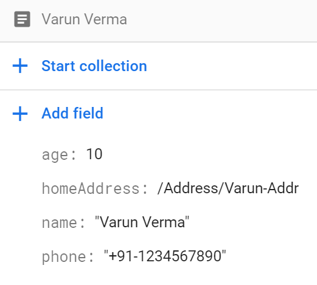

# Reference Collections
Firebase allows you to reference documents of other collections. 

Consider the example below of Person and Anddress

```
@FirebaseCollection()
class Address {
    @DocumentKey(DocumentKeyType.UserDefined)
    addrKey: String = "";

    @DocumentField
    streetName?: String;

    @DocumentField
    houseNumer?: String;
}
```

The Person document has a address field that stores reference to the address
```
@FirebaseCollection()
class Person{

    @DocumentKey(DocumentKeyType.UserDefined)
    name: String;

    @DocumentField
    age: Number;

    location?: String;

    @DocumentField
    phone: String;

    @DocumentField
    homeAddress?: Address;

    constructor(name: String){
        this.name = name;
    }

}
```

## Create Document
Create the address by the normal method.
```
const addressCollection = jugnu.createFirebaseCollection(Address);

const addr = new Address();
addr.addrKey = "Varun-Addr";
addr.streetName = "My Street Address";
addr.houseNumer = "My House No";
addressCollection.create(addr);     // Create new Address
```

Create person, with reference to Address.
```
const personCollection = jugnu.createFirebaseCollection(Person);

const varun = new Person("Varun Verma");
varun.age = 25;
varun.location = "India";
varun.phone = "+91-1234567890";
varun.homeAddress = addr;           // Set address in Person

personCollection.create(varun); 

```

The person document is created with Address as a reference document
 


## Query Single Document with Key
Querying document will also query the referenced documents and populate their properties.
```
let p: Person;
p = await personCollection.getDocument("Varun Verma");
console.log("Person Details", p);
```
The output will be: 
```
Person {
  age: 25,
  phone: '+91-1234567890',
  homeAddress: {
    houseNumer: 'My House No',
    addrKey: 'Varun-Addr',
    streetName: 'My Street Address'
  },
  name: 'Varun Verma'
}
```

## Delete Document
Delete will delete only the main document. The referenced document will not be deleted.